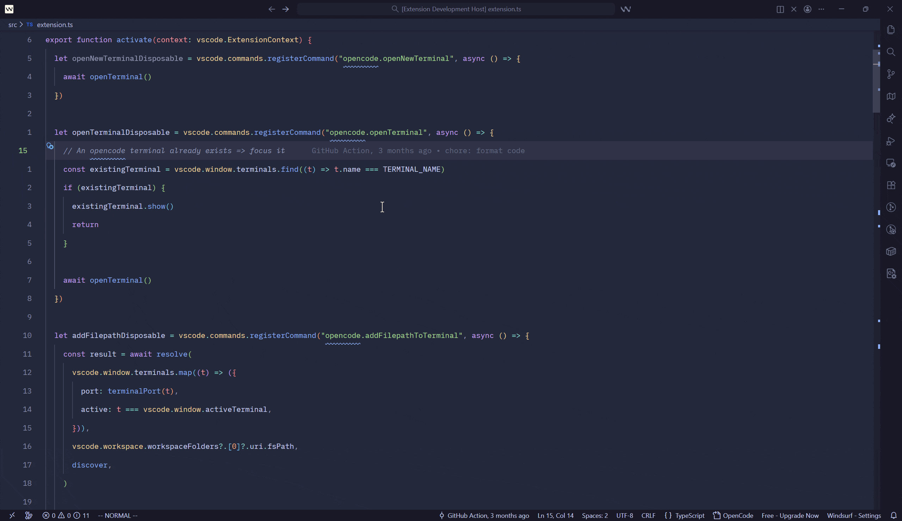

# OpenCode QoL

[](https://github.com/stevohuncho/vscode-opencode-qol)

**Use OpenCode from inside VS Code without switching context.**

OpenCode is a powerful agentic assistant that can run in its TUI. OpenCode QoL connects that TUI to VS Code so you can send files, folders, and selected code to the correct OpenCode instance from the editor.



The project source and issue tracker are hosted at [stevohuncho/vscode-opencode-qol](https://github.com/stevohuncho/vscode-opencode-qol).

## Features

- **Workspace-aware connections**: Finds running OpenCode servers, verifies the workspace they serve, and routes commands to the matching instance. This also works for files in multi-root workspaces.
- **Automatic instance management**: Reuses a matching running instance or starts OpenCode automatically in an integrated terminal on an available port.
- **Editor-tab instances**: Open or resume OpenCode in a terminal editor tab, keeping the terminal panel available for other work.
- **File and folder references**: Send one or more Explorer-selected files or folders to the active OpenCode prompt. References use workspace-relative paths when possible and absolute paths when necessary.
- **Selection references**: Send a selected line range from the editor using OpenCode reference syntax such as `@src/main.ts#10-20`.
- **Instance selection**: View available instances for the current workspace and choose a session-only default instance.
- **Connection status**: The status bar shows whether OpenCode is connected and displays the active port.
- **Automatic terminal focus**: Optionally focus the OpenCode terminal after adding a file or selection.

## Commands

| Command | Where to use it | Description |
|---------|-----------------|-------------|
| `OpenCode: Add File to Prompt` | Explorer context menu | Add selected files or folders to the active prompt. Multiple resources are supported. |
| `OpenCode: Add Selection to Prompt` | Editor context menu | Add the selected code range to the active prompt. Only shown when text is selected. |
| `OpenCode: Open New Instance` | Editor title bar | Find or start an OpenCode instance for the active workspace and open it as an editor tab. |
| `OpenCode: Check Instance` | Command Palette | Check whether an OpenCode instance is connected to the active workspace. |
| `OpenCode: Show Menu` | OpenCode status bar item | Open the connection menu. |
| `OpenCode: Select Default Instance` | Command Palette or status bar menu | Select a running instance for the current workspace for the current VS Code session. |
| `OpenCode: Show Go Usage` | Command Palette or status bar menu | Show authenticated OpenCode Go rolling, weekly, and monthly quota usage. |
| `OpenCode: Toggle Focus Terminal` | Command Palette | Focus the existing OpenCode terminal in a maximized, single-tab Zen Mode layout, or restore the previous layout. |

## Usage

1. Open a project folder or workspace in VS Code.
2. Use the OpenCode button in the editor title bar to open or resume an instance, or let a send command start one automatically.
3. Right-click a file or folder in Explorer and select **Add File to Prompt**.
4. Select code in the editor, right-click, and select **Add Selection to Prompt**.
5. Review the references in the OpenCode TUI and submit the prompt there.

The extension appends references to the current TUI prompt; it does not submit the prompt automatically.

When the connected instance uses OpenCode Go, **Show Go Usage** reads the OpenCode API key from
OpenCode's local authentication store and queries the authenticated Go usage endpoint. The command
requires an active OpenCode Go subscription and does not log or display the API key.

## OpenCode Connection

The extension connects to OpenCode over its local server API. It first looks for an existing OpenCode process serving the target workspace. If none is found, it starts OpenCode with `--port` in the VS Code integrated terminal and waits for the server to become ready.

To start an instance manually, run this from the project directory:

```bash
opencode --port 4096
```

The extension will discover the instance and match it to the workspace. Automatically started instances use the first available port in the `4096`-`5096` range.

## Configuration

Configure these settings in VS Code settings or `settings.json`:

| Setting | Type | Default | Description |
|---------|------|---------|-------------|
| `opencode.port` | number | `4096` | Port used when checking the configured OpenCode server. |
| `opencode.binaryPath` | string | `""` | Absolute path to the OpenCode binary. Leave empty to resolve `opencode` from `PATH`. |
| `opencode.autoFocusTerminal` | boolean | `true` | Focus the OpenCode terminal after adding files or selections. |

The selected default instance is stored in memory only and is cleared when the workspace changes or the extension is reloaded.

## Requirements

- VS Code 1.94.0 or higher
- [OpenCode](https://opencode.ai) installed and available in `PATH`, or configured with `opencode.binaryPath`

## Local Development

Install dependencies and compile the extension:

```bash
npm install
npm run compile
```

Package and install the extension locally as a VSIX:

```bash
npm run pack
code --install-extension ./dist/opencode-qol.vsix --force
```

Reload VS Code after installing the local VSIX.

## Credits

This extension is inspired by:

- [OpenCode VSCode SDK](https://github.com/anomalyco/opencode/tree/dev/sdks/vscode)
- [opencode.nvim](https://github.com/NickvanDyke/opencode.nvim)
